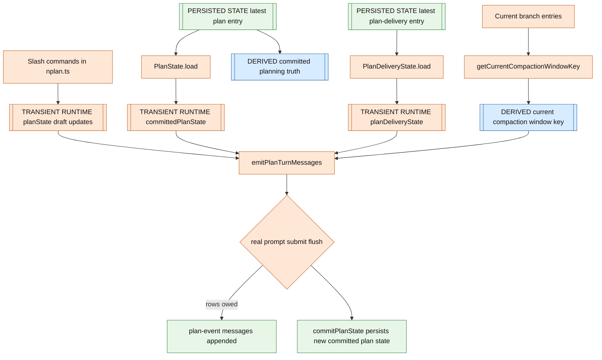
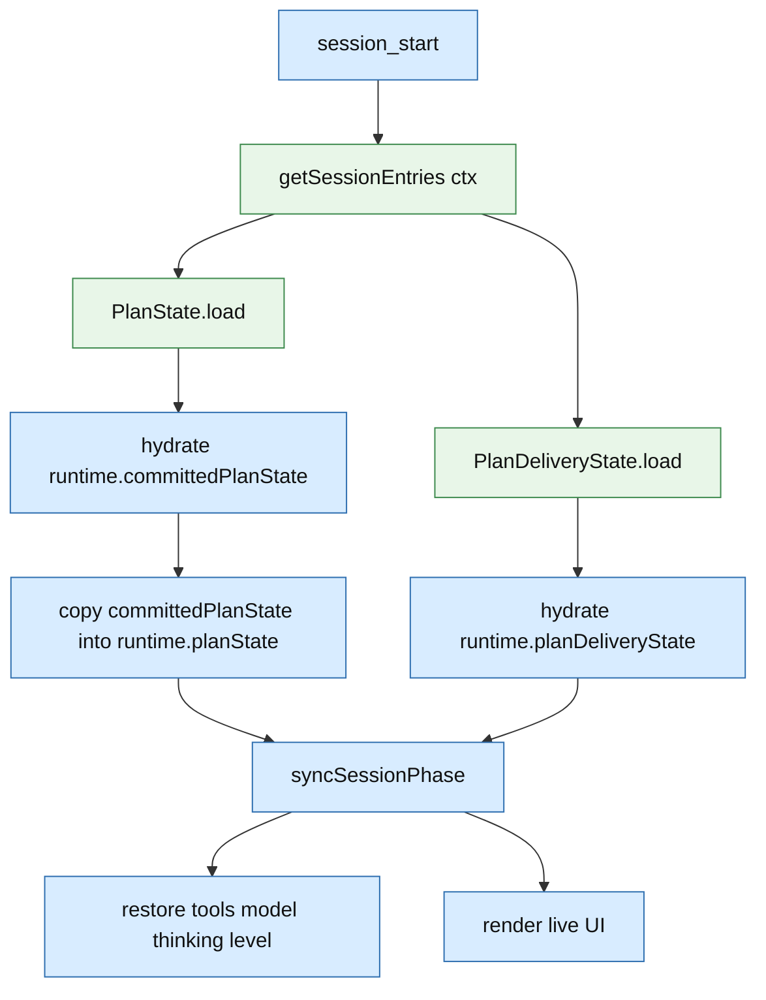

# nplan Plan State Information Architecture

This document is current state map for `nplan`.

It answers four questions:

- what state exists
- where that state is stored
- how current behavior is derived from it
- how lifecycle delivery avoids duplicate or self-cancelled rows

`docs/prompts.md` is contract.
This file is concrete storage and derivation model.

## State Categories

| Category | Meaning | Storage |
|---|---|---|
| `[PERSISTED STATE]` | state explicitly written by `nplan` for later restore | session entries in branch/session file |
| `[PERSISTED TRANSCRIPT]` | visible transcript/tool rows that persist as history but are not control state | session entries in branch/session file |
| `[DERIVED STATE]` | state recomputed from persisted entries | computed at runtime |
| `[TRANSIENT RUNTIME]` | in-memory process state only | current extension process only |

## Persisted State Inventory

### `[PERSISTED STATE]` `customType: "plan"`

Written by `commitPlanState(...)` / `persistState(...)` in `nplan-phase.ts`.
Read by `PlanState.load(...)` in `models/plan-state.ts`.

Persisted fields:

```json
{
  "type": "custom",
  "customType": "plan",
  "data": {
    "phase": "planning",
    "attachedPlanPath": "/abs/path/plan.md",
    "idleKind": null,
    "savedState": {
      "activeTools": ["read", "bash", "edit", "write"],
      "thinkingLevel": "medium"
    }
  }
}
```

Meaning of persisted fields:

| Field | Meaning | Used by |
|---|---|---|
| `phase` | committed planning vs idle truth | restore, tool gating, lifecycle derivation |
| `attachedPlanPath` | committed attached global plan path | restore, status/UI, lifecycle derivation |
| `idleKind` | why planning last ended, currently `manual` or `approved` | approval and status behavior |
| `savedState.activeTools` | tools to restore after planning | phase restore |
| `savedState.model` | model to restore after planning | phase restore |
| `savedState.thinkingLevel` | thinking level to restore after planning | phase restore |

### `[PERSISTED STATE]` `customType: "plan-delivery"`

Written by `persistState(...)` in `nplan-phase.ts`.
Read by `PlanDeliveryState.load(...)` in `models/plan-delivery-state.ts`.

Persisted fields:

```json
{
  "type": "custom",
  "customType": "plan-delivery",
  "data": {
    "planningPromptWindowKey": "root"
  }
}
```

Meaning of persisted fields:

| Field | Meaning | Used by |
|---|---|---|
| `planningPromptWindowKey` | compaction window that already received full planning prompt | prompt resend gating |

### `[PERSISTED TRANSCRIPT]` `customType: "plan-event"`

Written by `createPlanEventMessage(...)` / `pi.sendMessage(...)`.
Not read for authoritative control decisions.

Persisted shape:

```json
{
  "type": "custom_message",
  "customType": "plan-event",
  "content": "Plan Started /abs/path/plan.md",
  "display": true,
  "details": {
    "kind": "started",
    "planFilePath": "/abs/path/plan.md",
    "title": "Plan Started /abs/path/plan.md",
    "body": "[PLAN - PLANNING PHASE] ..."
  }
}
```

Important distinction:

- this is `[PERSISTED TRANSCRIPT]`, not dedicated control state
- it is visible artifact first
- `nplan` does not read it back to decide lifecycle delivery

### `[PERSISTED TRANSCRIPT]` `type: "compaction"`

Written by Pi compaction, not by `nplan`.
Read by `getCurrentCompactionWindowKey(...)` in `nplan-turn-messages.ts`.

Important persisted field:

| Field | Meaning |
|---|---|
| `firstKeptEntryId` | first entry still inside current compaction window |

## Transient Runtime Inventory

These fields exist in in-memory `Runtime` object in `nplan-phase.ts`.

| Field | Category | Meaning |
|---|---|---|
| `planState` | `[TRANSIENT RUNTIME]` | current draft/effective plan state for UI and command flow |
| `committedPlanState` | `[TRANSIENT RUNTIME]` | latest committed persisted plan state loaded from or ready for `customType: "plan"` |
| `planDeliveryState` | `[TRANSIENT RUNTIME]` | in-memory instance of canonical prompt-window delivery state |
| `planConfig` | `[TRANSIENT RUNTIME]` | loaded config for this process |
| `lastPromptWarning` | `[TRANSIENT RUNTIME]` | warning dedupe only |

Important distinction:

- `planState` may diverge from persisted truth while user is staging slash-command changes
- `committedPlanState` is last agent-visible committed truth
- lifecycle rows derive from `committedPlanState` -> `planState` at real prompt submit time

## Derivation Map



## Restore Path



## Exact Injection Sites

Lifecycle rows are computed in one owner: `emitPlanTurnMessages(...)` in `nplan-turn-messages.ts`.

That owner is reached from:

1. `registerInputLifecycle(...)` in `nplan-input-lifecycle.ts`
   - non-extension `input` with UI
   - emits rows JIT
   - commits draft state
   - returns `continue` so Pi keeps native prompt routing
2. `registerBeforeAgentStartHandler(...)` in `nplan.ts`
   - fallback only for `ctx.hasUI === false`

Interactive UI flow therefore has one JIT owner.

## Why Duplicate Rows Stop Here

Old bug shape was: one-shot lifecycle row got reconstructed from steady state more than once.

Current design prevents that because:

- commands only mutate draft runtime state
- transcript rows are never emitted during command staging
- real prompt submit computes one net transition from `committedPlanState` to final `planState`
- self-cancelled intermediate drafts disappear because only final draft matters
- transcript artifacts are not read back for control

## What Is Persisted Versus Not Persisted

| Thing | Persisted? | Authority? |
|---|---|---|
| committed planning phase/path/saved restore snapshot | yes | yes |
| compaction-window prompt delivery ack | yes | yes |
| visible `plan-event` transcript rows | yes | no |
| draft slash-command changes before a real prompt submit | no | no |
| live footer/widget rendering | no | no |

## Source Of Truth Summary

- committed planning truth lives in `PlanState`
- prompt resend truth lives in `PlanDeliveryState`
- visible transcript rows are artifacts, not control state
- draft slash-command intent lives only in transient runtime memory until real prompt submit