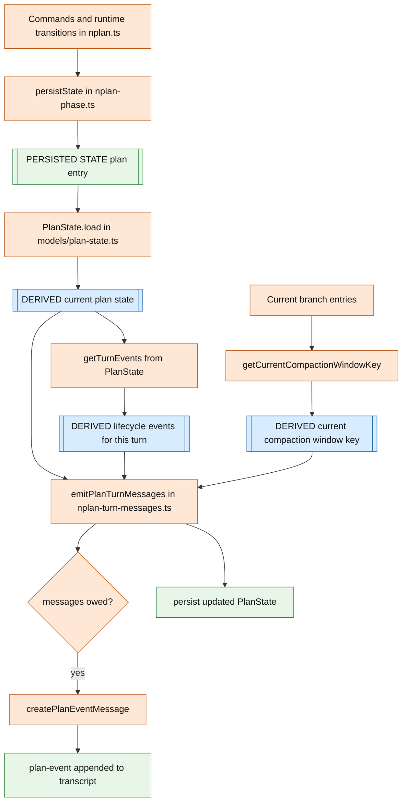
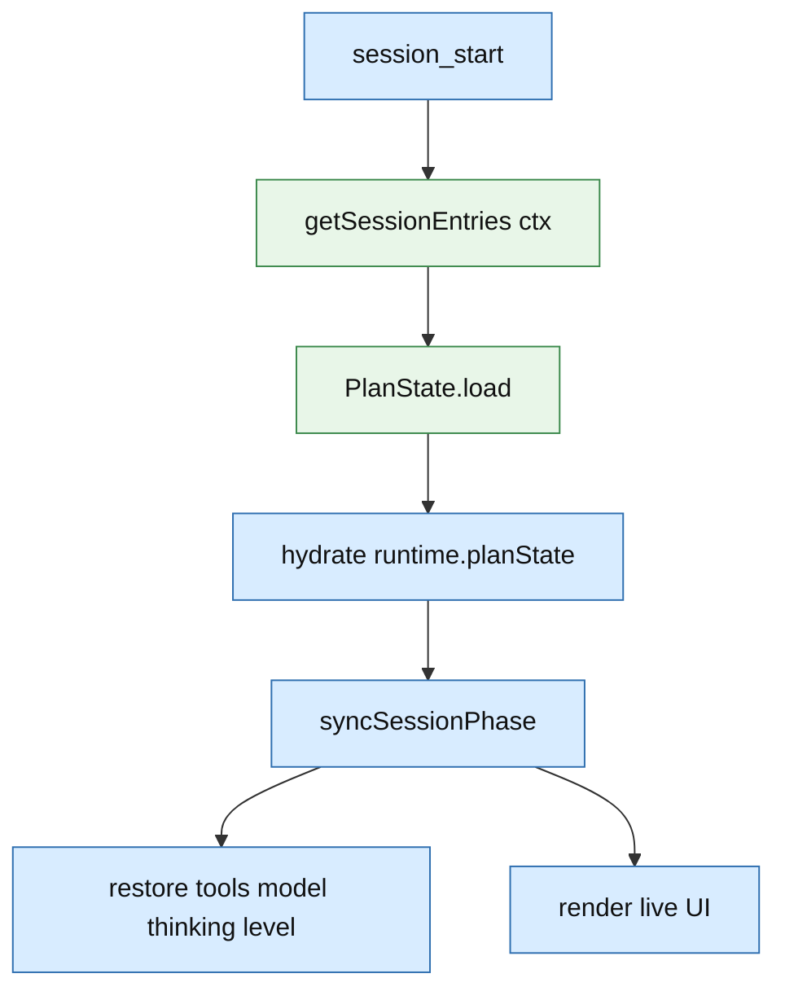

# nplan Plan State Information Architecture

This document is the current state map for `nplan`.

It answers four questions:

- what state exists
- where that state is stored
- how current behavior is derived from it
- how lifecycle delivery now stays state-driven

`docs/prompts.md` is still the contract.
This file is the concrete storage and derivation model.

## State Categories

| Category | Meaning | Storage |
|---|---|---|
| `[PERSISTED STATE]` | state explicitly written by `nplan` for later restore/replay | session entries in the branch/session file |
| `[PERSISTED TRANSCRIPT]` | visible transcript/tool rows that persist as history but are not the dedicated phase-state record | session entries in the branch/session file |
| `[DERIVED STATE]` | state recomputed by scanning persisted entries | computed at runtime |
| `[TRANSIENT RUNTIME]` | in-memory process state only | current extension process only |

## Persisted State Inventory

### `[PERSISTED STATE]` `customType: "plan"`

Written by `persistState(...)` in `nplan-phase.ts`.
Read by `PlanState.load(...)` in `models/plan-state.ts`.

Persisted fields:

```json
{
  "type": "custom",
  "customType": "plan",
  "data": {
    "phase": "planning",
    "attachedPlanPath": "/abs/path/plan.md",
    "planningKind": "resumed",
    "idleKind": null,
    "pendingEvents": [],
    "hasDeliveredPlanningRow": true,
    "planningPromptWindowKey": "root",
    "savedState": {
      "activeTools": ["read", "bash", "edit", "write"],
      "thinkingLevel": "medium"
    }
  }
}
```

Meaning of persisted fields:

| Field | Meaning | Used by |
|---|---|---|
| `phase` | whether the session is in planning or idle | restore, tool gating, lifecycle derivation |
| `attachedPlanPath` | current attached global plan path | restore, lifecycle derivation, status/UI |
| `planningKind` | whether planning should be treated as `started` or `resumed` | lifecycle derivation |
| `idleKind` | why planning last ended, currently `manual` or `approved` | ended/approved lifecycle behavior |
| `pendingEvents` | one-shot lifecycle rows still owed on the next real turn | lifecycle delivery |
| `hasDeliveredPlanningRow` | whether current attached planning cycle has ever shown a planning row | stop/abandon gating |
| `planningPromptWindowKey` | compaction window key that already received the full planning prompt | prompt resend gating |
| `savedState.activeTools` | tools to restore after planning | phase restore |
| `savedState.model` | model to restore after planning | phase restore |
| `savedState.thinkingLevel` | thinking level to restore after planning | phase restore |

### `[PERSISTED TRANSCRIPT]` `customType: "plan-event"`

Written by `createPlanEventMessage(...)` / `pi.sendMessage(...)`.
Not read for authoritative control decisions.

Persisted shape:

```json
{
  "type": "custom_message",
  "customType": "plan-event",
  "content": "Plan Resumed /abs/path/plan.md",
  "display": true,
  "details": {
    "kind": "resumed",
    "planFilePath": "/abs/path/plan.md",
    "title": "Plan Resumed /abs/path/plan.md",
    "body": ""
  }
}
```

Important distinction:

- this is `[PERSISTED TRANSCRIPT]`, not the dedicated persisted phase-state record
- it is a visible artifact first
- `nplan` does not read it back to decide lifecycle delivery anymore

### `[PERSISTED TRANSCRIPT]` `type: "compaction"`

Written by Pi compaction, not by `nplan`.
Read by `getCurrentCompactionWindow(...)` in `nplan-turn-messages.ts`.

Important persisted field:

| Field | Meaning |
|---|---|
| `firstKeptEntryId` | first entry still inside the current compaction window |

`nplan` uses that persisted compaction marker to decide whether the full planning prompt has already been sent in the current window.

### `[PERSISTED TRANSCRIPT]` tool call/result history

Includes ordinary `plan_submit` tool call/result entries.

Used for:

- visible review rows through rendering
- ordinary transcript/model history

Not used as the dedicated persisted plan phase state.

## Transient Runtime Inventory

These fields exist in the in-memory `Runtime` object in `nplan-phase.ts`.

| Field | Category | Meaning |
|---|---|---|
| `planState` | `[TRANSIENT RUNTIME]` | in-memory instance of canonical `PlanState` model |
| `skipNextBeforeAgentPlanMessage` | `[TRANSIENT RUNTIME]` | one-shot dedupe between submit interceptor and immediate `before_agent_start` |
| `planConfig` | `[TRANSIENT RUNTIME]` | loaded config for this process |
| `lastPromptWarning` | `[TRANSIENT RUNTIME]` | warning dedupe only |

Important distinction:

- `planState` is later written into `[PERSISTED STATE]` `customType: "plan"`
- `skipNextBeforeAgentPlanMessage` is not persisted
- there is no transcript-derived control state in the lifecycle path

## Derivation Map



## Restore Path



## Exact Injection Sites

Lifecycle rows can only be injected through two paths:

1. `registerSubmitInterceptor(...)` in `nplan-submit-interceptor.ts`
   - real Enter submit
   - calls `emitPlanTurnMessages(...)`
2. `registerBeforeAgentStartHandler(...)` in `nplan.ts`
   - normal turn-start fallback
   - calls `emitPlanTurnMessages(...)`

So the injection trigger is always:

- some turn-start path runs
- `emitPlanTurnMessages(...)` reads canonical `PlanState`

## Old Duplicate `Plan Resumed` Bug


Old bug existed because one decision used two authorities:

- `[PERSISTED STATE]` latest `plan` entry for current phase state
- `[PERSISTED TRANSCRIPT]` scan of `plan-event` rows for delivery history

Current runtime no longer does this.
Lifecycle delivery now comes from `PlanState.pendingEvents`, `PlanState.hasDeliveredPlanningRow`, `PlanState.planningKind`, and `PlanState.planningPromptWindowKey`.

## What Is Persisted Versus Not Persisted

| Concern | Persisted? | Authority |
|---|---|---|
| phase | yes | `[PERSISTED STATE]` `plan.data.phase` |
| attached plan path | yes | `[PERSISTED STATE]` `plan.data.attachedPlanPath` |
| planning kind | yes | `[PERSISTED STATE]` `plan.data.planningKind` |
| idle kind | yes | `[PERSISTED STATE]` `plan.data.idleKind` |
| restore tools/model/thinking | yes | `[PERSISTED STATE]` `plan.data.savedState` |
| lifecycle rows owed on next turn | yes | `[PERSISTED STATE]` `plan.data.pendingEvents` |
| whether current planning cycle has ever shown a planning row | yes | `[PERSISTED STATE]` `plan.data.hasDeliveredPlanningRow` |
| prompt resent in current compaction window | yes, keyed by compaction window | `[PERSISTED STATE]` `plan.data.planningPromptWindowKey` + `[PERSISTED TRANSCRIPT]` `compaction` |
| one-shot interceptor dedupe | no | `[TRANSIENT RUNTIME]` `skipNextBeforeAgentPlanMessage` |

## Important Files

- `models/plan-state.ts`: canonical persisted plan-state model
- `models/saved-phase-state.ts`: persisted saved-tools/model/thinking snapshot model
- `models/plan-lifecycle-event.ts`: persisted one-shot lifecycle event model
- `nplan-phase.ts`: writes `[PERSISTED STATE]` `customType: "plan"`
- `nplan-events.ts`: writes `[PERSISTED TRANSCRIPT]` `plan-event` rows
- `nplan-turn-messages.ts`: combines canonical plan state with compaction window key and emits lifecycle rows
- `nplan-submit-interceptor.ts`: one injection path for lifecycle rows
- `nplan.ts`: fallback injection path and session restore wiring