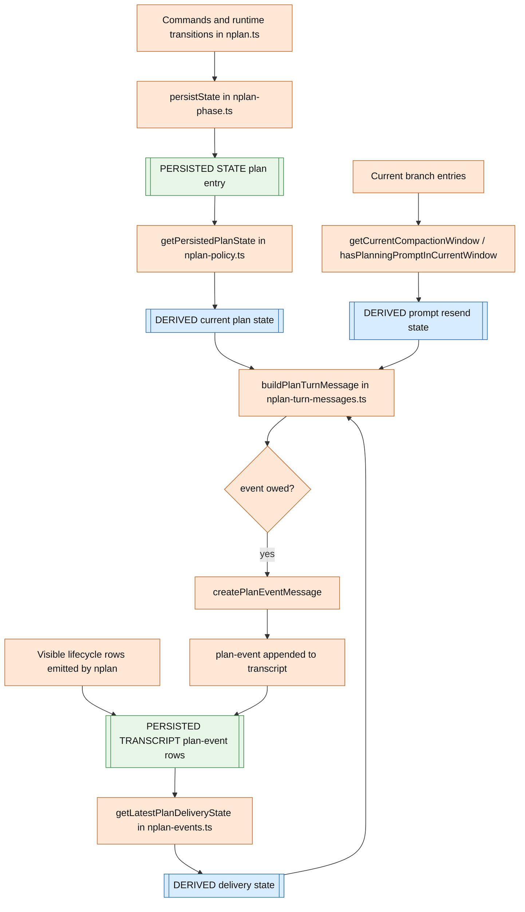
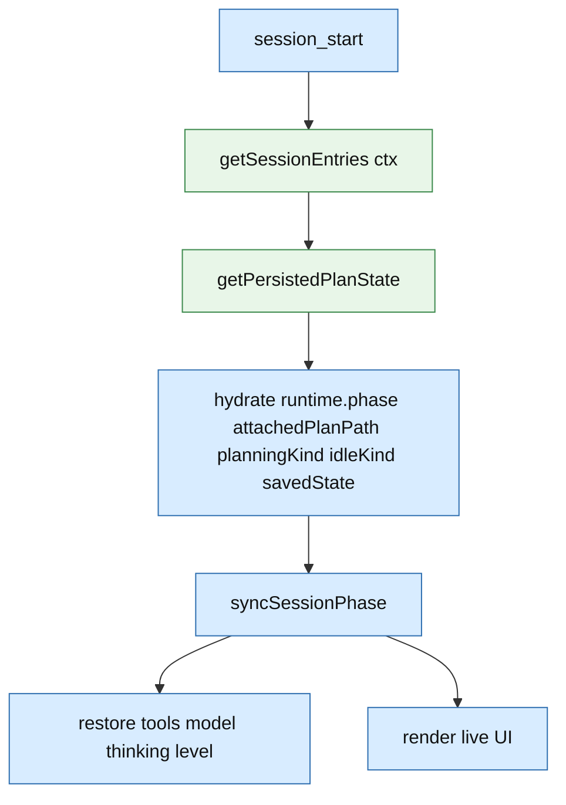
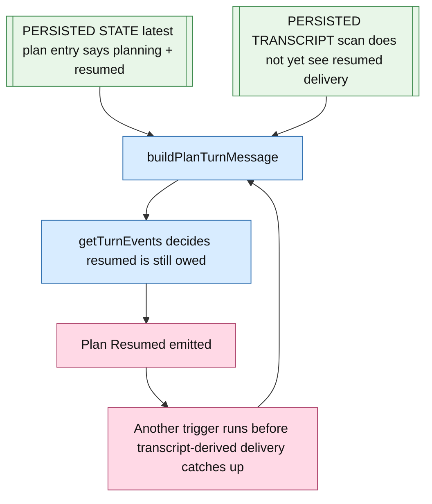

# nplan Plan State Information Architecture

This document is the state map for `nplan`.

It answers four questions:

- what state exists
- where that state is stored
- how current behavior is derived from it
- where the duplicate `Plan Resumed` bug comes from

`docs/prompts.md` is still the contract.
This file is the concrete storage and derivation model.

## State Categories

| Category | Meaning | Storage |
|---|---|---|
| `[PERSISTED STATE]` | state explicitly written by `nplan` for later restore/replay | session entries in the branch/session file |
| `[PERSISTED TRANSCRIPT]` | visible transcript/tool rows that persist as history but are not the dedicated phase-state record | session entries in the branch/session file |
| `[DERIVED STATE]` | state recomputed by scanning persisted entries | computed at runtime |
| `[TRANSIENT RUNTIME]` | in-memory process state only | current extension process only |

## Persisted State Inventory

### `[PERSISTED STATE]` `customType: "plan"`

Written by `persistState(...)` in `nplan-phase.ts`.
Read by `getPersistedPlanState(...)` in `nplan-policy.ts`.

Persisted fields:

```json
{
  "type": "custom",
  "customType": "plan",
  "data": {
    "phase": "planning",
    "attachedPlanPath": "/abs/path/plan.md",
    "planningKind": "resumed",
    "idleKind": null,
    "savedState": {
      "activeTools": ["read", "bash", "edit", "write"],
      "model": { "provider": "openai", "id": "gpt-5" },
      "thinkingLevel": "medium"
    }
  }
}
```

Meaning of persisted fields:

| Field | Meaning | Used by |
|---|---|---|
| `phase` | whether the session is in planning or idle | restore, tool gating, lifecycle derivation |
| `attachedPlanPath` | current attached global plan path | restore, lifecycle derivation, status/UI |
| `planningKind` | whether planning should be treated as `started` or `resumed` | lifecycle derivation |
| `idleKind` | why planning last ended, currently `manual` or `approved` | ended/approved lifecycle behavior |
| `savedState.activeTools` | tools to restore after planning | phase restore |
| `savedState.model` | model to restore after planning | phase restore |
| `savedState.thinkingLevel` | thinking level to restore after planning | phase restore |

### `[PERSISTED TRANSCRIPT]` `customType: "plan-event"`

Written by `createPlanEventMessage(...)` / `pi.sendMessage(...)`.
Read by `getLatestPlanDeliveryState(...)` and `hasPlanningPromptInCurrentWindow(...)`.

Persisted shape:

```json
{
  "type": "custom_message",
  "customType": "plan-event",
  "content": "Plan Resumed /abs/path/plan.md",
  "display": true,
  "details": {
    "kind": "resumed",
    "planFilePath": "/abs/path/plan.md",
    "title": "Plan Resumed /abs/path/plan.md",
    "body": ""
  }
}
```

Important distinction:

- this is `[PERSISTED TRANSCRIPT]`, not the dedicated persisted phase-state record
- it is a visible artifact first
- `nplan` currently scans it to infer delivery history

### `[PERSISTED TRANSCRIPT]` `type: "compaction"`

Written by Pi compaction, not by `nplan`.
Read by `getCurrentCompactionWindow(...)` in `nplan-turn-messages.ts`.

Important persisted field:

| Field | Meaning |
|---|---|
| `firstKeptEntryId` | first entry still inside the current compaction window |

`nplan` uses that persisted compaction marker to decide whether the full planning prompt has already been sent in the current window.

### `[PERSISTED TRANSCRIPT]` tool call/result history

Includes ordinary `plan_submit` tool call/result entries.

Used for:

- visible review rows through rendering
- ordinary transcript/model history

Not used as the dedicated persisted plan phase state.

## Transient Runtime Inventory

These fields exist in the in-memory `Runtime` object in `nplan-phase.ts`.

| Field | Category | Meaning |
|---|---|---|
| `phase` | `[TRANSIENT RUNTIME]` | live phase mirror while process is running |
| `attachedPlanPath` | `[TRANSIENT RUNTIME]` | live attached path mirror |
| `planningKind` | `[TRANSIENT RUNTIME]` | live start/resume mirror |
| `idleKind` | `[TRANSIENT RUNTIME]` | live end reason mirror |
| `savedState` | `[TRANSIENT RUNTIME]` | live copy of restore targets before persistence |
| `skipNextBeforeAgentPlanMessage` | `[TRANSIENT RUNTIME]` | one-shot dedupe between submit interceptor and immediate `before_agent_start` |
| `planConfig` | `[TRANSIENT RUNTIME]` | loaded config for this process |
| `lastPromptWarning` | `[TRANSIENT RUNTIME]` | warning dedupe only |

Important distinction:

- some of these fields are later written into `[PERSISTED STATE]` `customType: "plan"`
- `skipNextBeforeAgentPlanMessage` is not persisted
- there is no persisted delivery-ack field for lifecycle rows

## Derivation Map



## Restore Path



## Exact Injection Sites

Lifecycle rows can only be injected through two paths:

1. `registerSubmitInterceptor(...)` in `nplan-submit-interceptor.ts`
   - real Enter submit
   - calls `buildPlanTurnMessage(...)`
   - directly sends the returned `plan-event`
2. `registerBeforeAgentStartHandler(...)` in `nplan.ts`
   - normal turn-start fallback
   - returns `buildPlanTurnMessage(...)` to Pi

So the injection trigger is always:

- some turn-start path runs
- `buildPlanTurnMessage(...)` decides a lifecycle row is still owed

## Duplicate `Plan Resumed` Bug



This bug exists because one decision uses two authorities:

- `[PERSISTED STATE]` latest `plan` entry for current phase state
- `[PERSISTED TRANSCRIPT]` scan of `plan-event` rows for delivery history

The code does not persist a dedicated lifecycle-delivery acknowledgement field.
So the delivery decision is not driven by one committed authority.

## What Is Persisted Versus Not Persisted

| Concern | Persisted? | Authority |
|---|---|---|
| phase | yes | `[PERSISTED STATE]` `plan.data.phase` |
| attached plan path | yes | `[PERSISTED STATE]` `plan.data.attachedPlanPath` |
| planning kind | yes | `[PERSISTED STATE]` `plan.data.planningKind` |
| idle kind | yes | `[PERSISTED STATE]` `plan.data.idleKind` |
| restore tools/model/thinking | yes | `[PERSISTED STATE]` `plan.data.savedState` |
| lifecycle row content already shown | only as transcript history, not as dedicated state | `[PERSISTED TRANSCRIPT]` `plan-event` scan |
| prompt resent in current compaction window | derived from transcript + compaction markers | `[PERSISTED TRANSCRIPT]` `plan-event` + `compaction` |
| one-shot interceptor dedupe | no | `[TRANSIENT RUNTIME]` `skipNextBeforeAgentPlanMessage` |

## Important Files

- `nplan-phase.ts`: writes `[PERSISTED STATE]` `customType: "plan"`
- `nplan-policy.ts`: reads `[PERSISTED STATE]` via `getPersistedPlanState(...)`
- `nplan-events.ts`: writes and scans `[PERSISTED TRANSCRIPT]` `plan-event` rows
- `nplan-turn-messages.ts`: combines persisted state, transcript-derived delivery state, and compaction-derived prompt state
- `nplan-submit-interceptor.ts`: one injection path for lifecycle rows
- `nplan.ts`: fallback injection path and session restore wiring