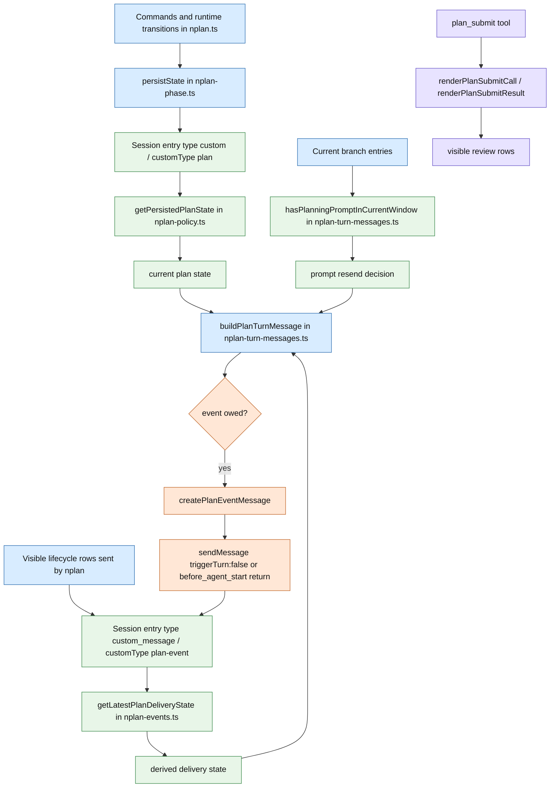
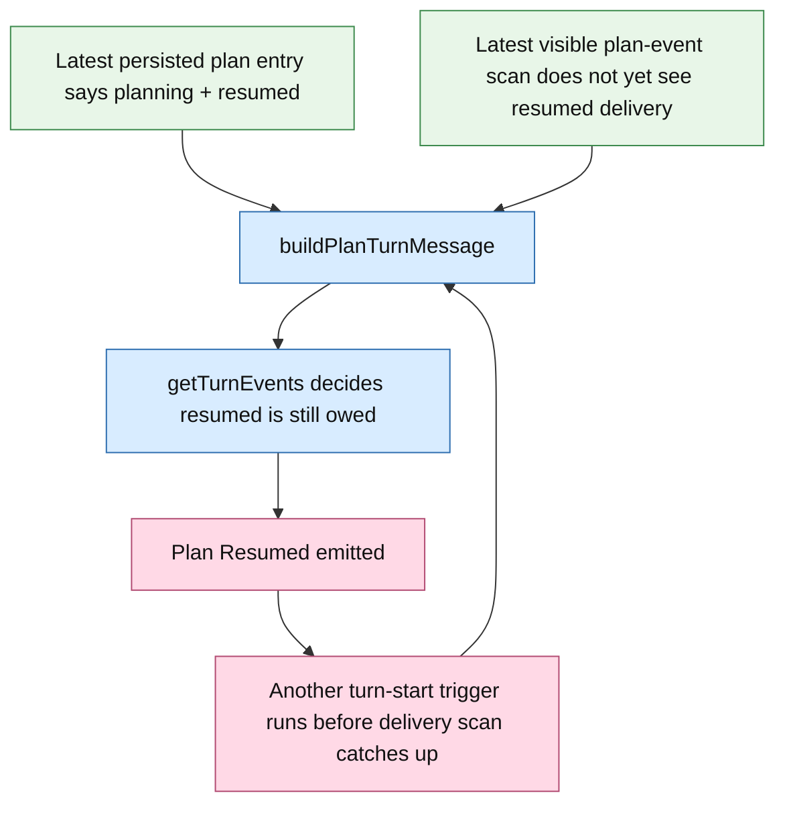

# nplan Planning Message Lifecycle

This document describes the current runtime architecture for planning and review rows.

`docs/prompts.md` is the required contract.
This file is the concrete information-architecture map for how state is stored, how lifecycle rows are derived, and where the duplicate `Plan Resumed` bug lives.

## Overview

- Persisted plan mode state lives in append-only `customType: "plan"` session entries.
- Delivered planning lifecycle state is inferred by scanning visible `customType: "plan-event"` message entries.
- Review rows are ordinary `plan_submit` tool call/result rows with custom visible rendering.
- `nplan` does not use hidden `plan-context` messages.
- `nplan` does not register a `context` hook or rewrite model context for planning/review rows.
- Full planning prompt body appears only on the first `Plan Started` or `Plan Resumed` row in the current compaction window.
- Approved `plan_submit` turns do not append a second completion row.

## Information Architecture

## Sources Of Truth

| Concern | Authority today | Derived by |
|---|---|---|
| Are we in planning? | latest persisted `plan` entry | `getPersistedPlanState(...)` |
| Which plan is attached? | latest persisted `plan` entry | `getPersistedPlanState(...)` |
| Is current planning turn `started` or `resumed`? | latest persisted `plan` entry | `getPersistedPlanState(...)` |
| Was plan mode manually ended or approved? | latest persisted `plan` entry | `getPersistedPlanState(...)` |
| What lifecycle row was last delivered? | latest visible `plan-event` message entry | `getLatestPlanDeliveryState(...)` |
| Whether planning prompt may be resent | visible `plan-event` rows in current compaction window | `hasPlanningPromptInCurrentWindow(...)` |
| Review request/result rows | tool call/result flow | `renderPlanSubmitCall(...)` / `renderPlanSubmitResult(...)` |

## Runtime Map

## Lifecycle Derivation Rule

`buildPlanTurnMessage(...)` is the lifecycle decision point.

It combines three separate inputs:

- `current` from `getPersistedPlanState(entries)`
- `delivered` from `getLatestPlanDeliveryState(entries)`
- prompt resend allowance from `hasPlanningPromptInCurrentWindow(entries)`

So the decision is not driven by one stored lifecycle record.
It is driven by a comparison between persisted phase state and transcript-derived delivery state.

## Exact Injection Sites

`Plan Started` / `Plan Resumed` / `Planning Ended` / `Plan Abandoned` can only be injected through two places:

1. `registerSubmitInterceptor(...)` in `nplan-submit-interceptor.ts`
   - Enter key on a real prompt submit
   - calls `buildPlanTurnMessage(...)`
   - directly sends the returned `plan-event` via `pi.sendMessage(..., { triggerTurn: false })`
2. `registerBeforeAgentStartHandler(...)` in `nplan.ts`
   - normal turn start fallback
   - returns `buildPlanTurnMessage(...)` result to Pi

If either path runs while `buildPlanTurnMessage(...)` still believes a resume row is owed, a new `Plan Resumed` row is injected.

## Planning Turns

Interactive Enter submit has its own fast path.
`registerSubmitInterceptor(...)` emits any owed `plan-event` row before the user message is appended, then sets `skipNextBeforeAgentPlanMessage` so `before_agent_start` does not emit the same row again.

If plan state changes without a user message yet, the owed lifecycle row is emitted on the next real turn:

- manual exit -> `Planning Ended <path>` on the next ordinary turn
- detach or switch -> `Plan Abandoned <old>` on the next real turn
- switch while planning -> `Plan Abandoned <old>` then `Plan Started <new>` or `Plan Resumed <new>` on that same later turn

## Compaction Window Rule

`nplan-turn-messages.ts` scans the current branch for the latest `compaction` entry.
If found, prompt-resend checks only look at entries from `firstKeptEntryId` onward.

- If the current window already contains a visible `Plan Started` or `Plan Resumed` row with a non-empty body, later planning rows in that window omit the full planning prompt body.
- If the current window does not contain such a row, the next `Plan Started` or `Plan Resumed` row includes the full planning prompt body.
- `Planning Ended` and `Plan Abandoned` never carry the full planning prompt.

## Review Flow

`plan_submit` stays on normal Pi tool plumbing:

- tool call row renders as `Plan Review` or `Plan Review 
`
- tool result row renders as `Plan Approved <path>`, `Plan Rejected <path>`, or `Error: ...`
- approval exits planning and restores normal tools
- rejection keeps planning active
- review-unavailable paths auto-approve intentionally
- failures stay tool results and render as `Error: ...`

There is no hidden review rewrite layer and no duplicate custom review row.

## Duplicate Resume Bug

The duplicate burst exists because lifecycle emission is not acknowledged in the same authority that stores plan phase.

Today the comparison is:

- current phase state from persisted `plan` entries
- last delivered lifecycle state from transcript scan of `plan-event` entries

That split makes the lifecycle decision non-idempotent under repeated evaluation.

## Consequence

If repeated turn-start triggers happen while persisted state still says `planning + resumed` and the delivery scan still does not see the already-emitted resume row, `nplan` can inject a burst of identical `Plan Resumed` rows.

## What The User Sees And What `nplan` Adds

| Surface | Source |
|---|---|
| Planning lifecycle rows | visible `plan-event` custom messages |
| Review request/result rows | `plan_submit` tool call/result renderers |
| Model-only planning/review additions from `nplan` | none |

## Important Files

- `nplan-phase.ts`: persists `customType: "plan"` session state
- `nplan-policy.ts`: reconstructs persisted plan state via `getPersistedPlanState(...)`
- `nplan-submit-interceptor.ts`: pre-submit `plan-event` emission for interactive Enter submits and fallback dedupe via `skipNextBeforeAgentPlanMessage`
- `nplan-turn-messages.ts`: computes owed lifecycle rows and prompt resend rule per compaction window
- `nplan-events.ts`: creates and scans visible `plan-event` transcript rows
- `nplan-review.ts`: `plan_submit` execution, auto-approve fallback, and review error handling
- `nplan-review-ui.ts`: `plan_submit` call/result rendering
- `nplan.ts`: wires `before_agent_start`, `plan_submit`, and phase transitions
