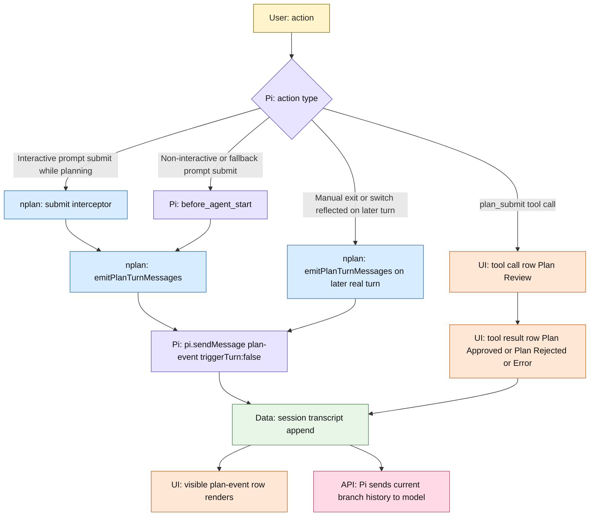

# nplan Planning Message Lifecycle

This document describes the current runtime architecture for planning and review rows.

`docs/prompts.md` is the required contract.
For the complete state map, read `docs/mermaid-plan-state-information-architecture.md`.

## Overview

- Review rows are ordinary `plan_submit` tool call/result rows with custom visible rendering.
- `nplan` does not use hidden `plan-context` messages.
- `nplan` does not register a `context` hook or rewrite model context for planning/review rows.
- Lifecycle delivery is driven by canonical `PlanState`, not by scanning `plan-event` transcript history.
- Full planning prompt body appears only on the first `Plan Started` or `Plan Resumed` row in the current compaction window.
- Approved `plan_submit` turns do not append a second completion row.

## Runtime Map

## Exact Injection Sites

`Plan Started` / `Plan Resumed` / `Planning Ended` / `Plan Abandoned` can only be injected through two places:

1. `registerSubmitInterceptor(...)` in `nplan-submit-interceptor.ts`
   - Enter key on a real prompt submit
   - calls `emitPlanTurnMessages(...)`
2. `registerBeforeAgentStartHandler(...)` in `nplan.ts`
   - normal turn start fallback
   - calls `emitPlanTurnMessages(...)`

If either path runs for a real turn while `PlanState` says lifecycle rows are owed, `emitPlanTurnMessages(...)` injects them.

## Planning Turns

Interactive Enter submit has its own fast path.
`registerSubmitInterceptor(...)` emits any owed `plan-event` row before the user message is appended, then sets `skipNextBeforeAgentPlanMessage` so `before_agent_start` does not emit the same row again.

If plan state changes without a user message yet, the owed lifecycle row is emitted on the next real turn:

- manual exit -> `Planning Ended <path>` on the next ordinary turn
- detach or switch -> `Plan Abandoned <old>` on the next real turn
- switch while planning -> `Plan Abandoned <old>` then `Plan Started <new>` or `Plan Resumed <new>` on that same later turn

## Compaction Window Rule

`nplan-turn-messages.ts` computes a compaction-window key from the latest `compaction` entry.
`PlanState.planningPromptWindowKey` records which window already received the full planning prompt.

- If `PlanState.planningPromptWindowKey` already matches the current window key, later planning rows in that window omit the full planning prompt body.
- If the current window key does not match, the next `Plan Started` or `Plan Resumed` row includes the full planning prompt body and state records that window key.
- `Planning Ended` and `Plan Abandoned` never carry the full planning prompt.

## Review Flow

`plan_submit` stays on normal Pi tool plumbing:

- tool call row renders as `Plan Review` or `Plan Review 
`
- tool result row renders as `Plan Approved <path>`, `Plan Rejected <path>`, or `Error: ...`
- approval exits planning and restores normal tools
- rejection keeps planning active
- review-unavailable paths auto-approve intentionally
- failures stay tool results and render as `Error: ...`

There is no hidden review rewrite layer and no duplicate custom review row.

## What The User Sees And What `nplan` Adds

| Surface | Source |
|---|---|
| Planning lifecycle rows | visible `plan-event` custom messages |
| Review request/result rows | `plan_submit` tool call/result renderers |
| Model-only planning/review additions from `nplan` | none |

## Important Files

- `nplan-submit-interceptor.ts`: pre-submit `plan-event` emission for interactive Enter submits and fallback dedupe via `skipNextBeforeAgentPlanMessage`
- `models/plan-state.ts`: canonical state for planning phase, pending lifecycle rows, and prompt-window delivery
- `nplan-turn-messages.ts`: emits lifecycle rows from `PlanState` and compaction window key
- `nplan-events.ts`: creates and renders visible `plan-event` transcript rows
- `nplan-review.ts`: `plan_submit` execution, auto-approve fallback, and review error handling
- `nplan-review-ui.ts`: `plan_submit` call/result rendering
- `nplan.ts`: wires `before_agent_start`, `plan_submit`, and phase transitions
