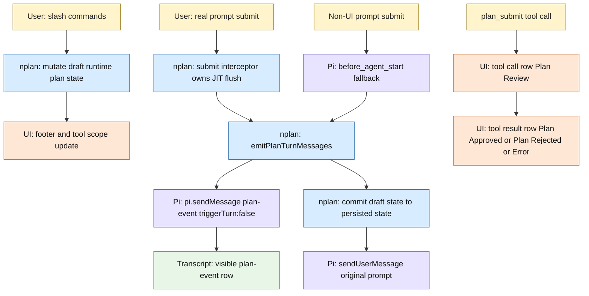

# nplan Planning Message Lifecycle

This document describes current runtime architecture for planning and review rows.

`docs/prompts.md` is required contract.
For full state map, read `docs/mermaid-plan-state-information-architecture.md`.

## Overview

- Review rows are ordinary `plan_submit` tool call/result rows with custom visible rendering.
- `nplan` does not use hidden `plan-context` messages.
- `nplan` does not register a `context` hook or rewrite model context for planning/review rows.
- Interactive planning lifecycle emission has one owner: submit interception in `nplan-submit-interceptor.ts`.
- Slash commands stage draft planning state in runtime memory only.
- Draft plan changes do not append lifecycle rows, create missing plan files, or commit persisted plan state on their own.
- Full planning prompt body appears only on `Plan Started` rows, and only once per compaction window.
- Approved `plan_submit` turns do not append a second completion row.

## Runtime Map

## Exact Injection Sites

`Plan Started` and `Plan Ended` can be injected only through `emitPlanTurnMessages(...)`.

That owner is reached from two transport paths:

1. `registerSubmitInterceptor(...)` in `nplan-submit-interceptor.ts`
   - interactive Enter submit
   - consumes default submit
   - emits any owed lifecycle rows
   - commits draft state
   - replays original prompt with `pi.sendUserMessage(...)`
2. `registerBeforeAgentStartHandler(...)` in `nplan.ts`
   - fallback only when `ctx.hasUI === false`
   - used for non-UI submit paths that cannot use terminal interception

Interactive UI flow has exactly one lifecycle injection owner.

## Planning Turns

Interactive Enter submit is JIT boundary.
`registerSubmitInterceptor(...)` emits any owed `plan-event` row before replaying submitted user prompt.

Lifecycle rows derive only from:

- committed persisted planning state before this prompt
- final draft runtime planning state at submit time
- current compaction window key

That means self-cancelled draft changes disappear naturally.

Examples:

- start A -> next real prompt emits `Plan Started A`
- stop A -> next real prompt emits `Plan Ended A`
- switch A -> B in one submitted turn -> `Plan Ended A`, then `Plan Started B`
- clear remembered plan while already idle -> no lifecycle row

## Compaction Window Rule

`nplan-turn-messages.ts` computes a compaction-window key from latest `compaction` entry.
`PlanDeliveryState.planningPromptWindowKey` records which window already received full planning prompt.

- If current window already matches, ordinary later planning turns stay silent.
- If current window changed while planning remains active, next real planning turn emits one `Plan Started <path>` row with full planning prompt body.
- `Plan Ended` never carries full planning prompt.

## Review Flow

`plan_submit` stays on normal Pi tool plumbing:

- tool call row renders as `Plan Review` or `Plan Review 
`
- tool result row renders as `Plan Approved <path>`, `Plan Rejected <path>`, or `Error: ...`
- approval exits planning and restores normal tools
- rejection keeps planning active
- review-unavailable paths auto-approve intentionally
- failures stay tool results and render as `Error: ...`

There is no hidden review rewrite layer and no duplicate custom review row.

## Important Files

- `nplan-submit-interceptor.ts`: interactive submit owner for JIT lifecycle emission
- `models/plan-state.ts`: canonical committed planning state shape
- `models/plan-delivery-state.ts`: canonical persisted compaction-window prompt-delivery state
- `nplan-turn-messages.ts`: computes lifecycle rows from committed state, draft state, and compaction window
- `nplan-events.ts`: creates and renders visible `plan-event` transcript rows
- `nplan-review.ts`: `plan_submit` execution, auto-approve fallback, and review error handling
- `nplan-review-ui.ts`: `plan_submit` call/result rendering
- `nplan.ts`: wires commands, session restore, fallback submit path, and phase transitions