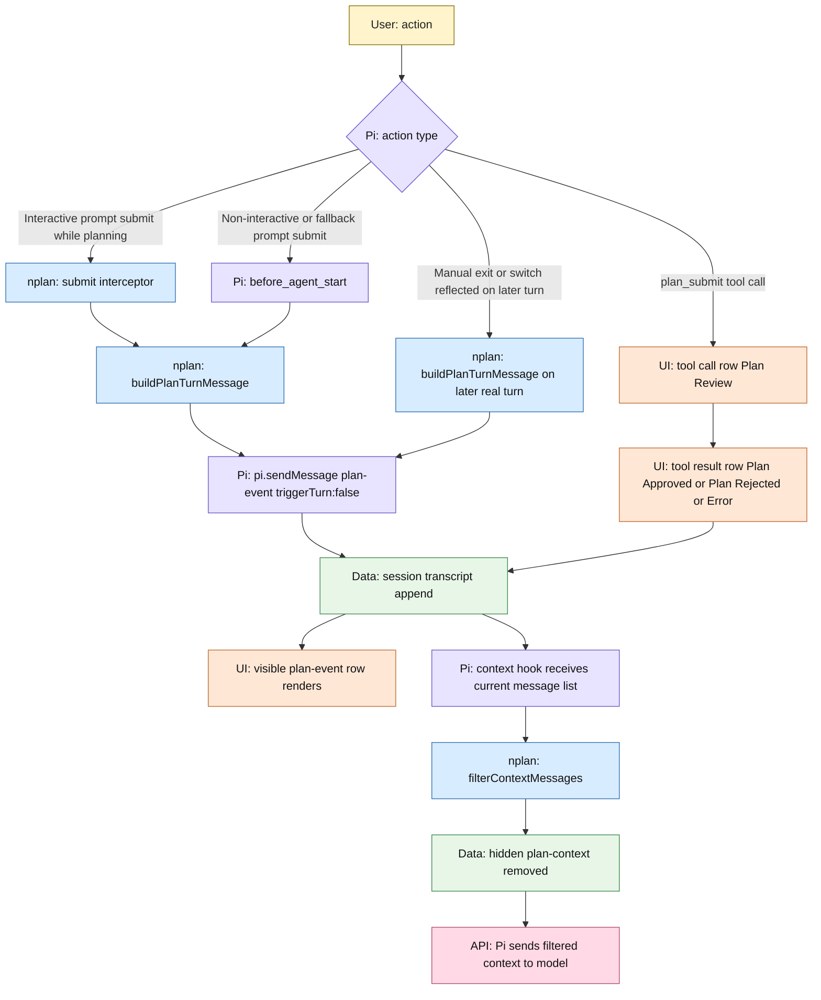
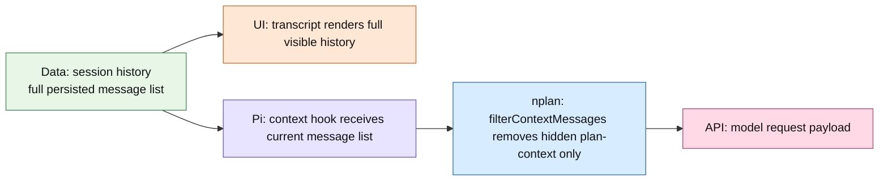
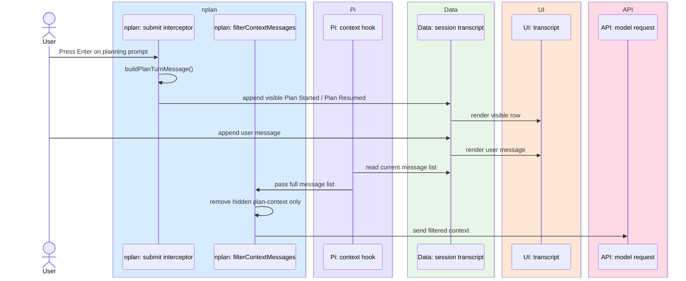
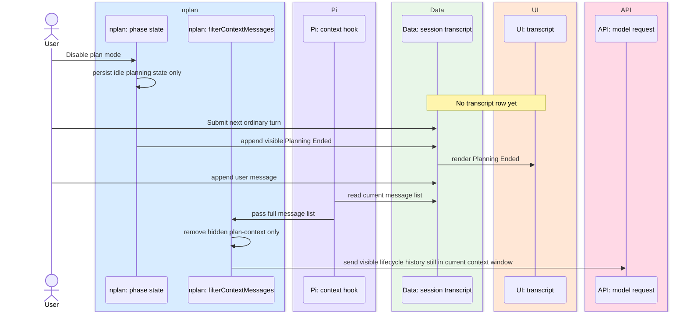
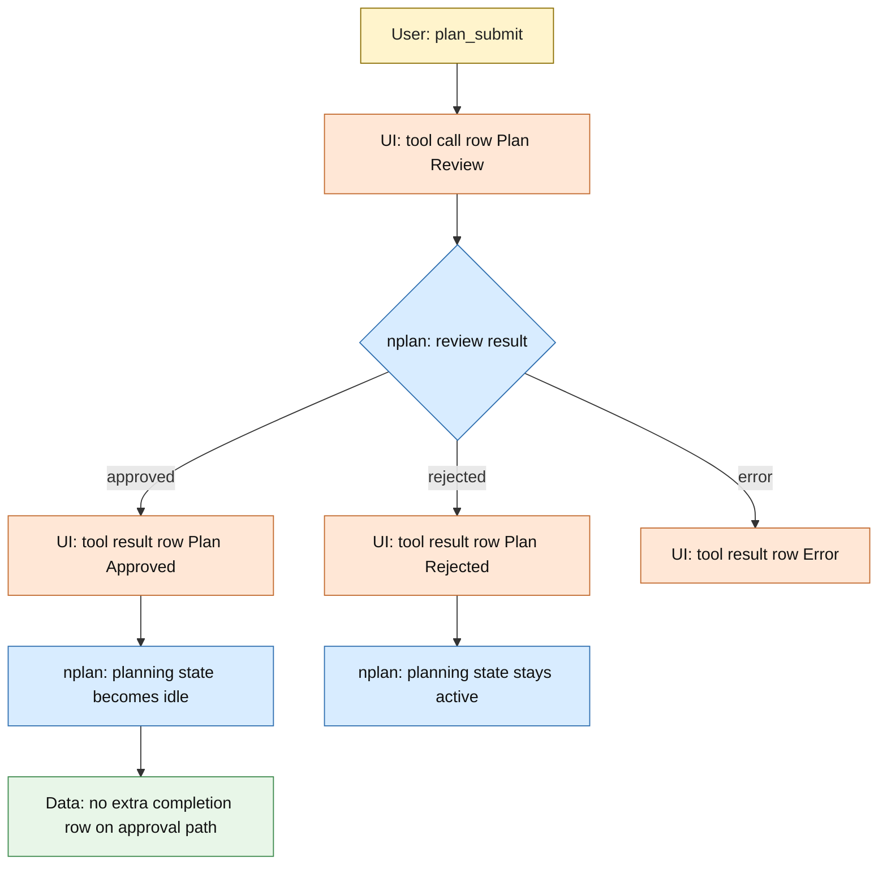

# nplan Planning Message Lifecycle

This document describes the current runtime architecture for planning messages.

`docs/prompts.md` is the required contract.
This file is the concrete pipeline map for how messages currently move through `nplan` and Pi.

## Overview

- `plan-event` messages are real persisted transcript entries.
- The UI renders the full persisted transcript history.
- The `context` hook removes hidden `plan-context` rows before Pi sends context to the model.
- Visible `plan-event` rows remain in agent context.
- Full planning prompt appears only on first planning lifecycle row in current compaction window.
- After compaction drops that prompt from model context, next planning turn emits it again.

## Diagram Legend

- `User`: human input
- `nplan`: extension-owned code in this repo
- `Pi`: Pi runtime hook or runtime-owned behavior
- `Data`: persisted session or transcript state
- `UI`: visible transcript or visible TUI surface
- `API`: model-facing request payload or model API boundary

## Runtime Map

## Pipeline Layers

## Interactive Planning Turn

## Manual Exit And Later Ordinary Turn

## Review Flow

## What The User Sees vs What The Agent Gets

| Layer | Data source | Current behavior |
|---|---|---|
| UI transcript | full persisted session history | shows all visible `plan-event` rows and all tool rows |
| Agent context | `context` hook output after `filterContextMessages(...)` | gets visible `plan-event` rows in current context plus normal tool/message history |

## Consequence

If transcript visibly contains `Plan Started ...` and later `Planning Ended ...`, UI shows both because both are persisted history entries.

Agent context keeps visible `plan-event` rows that remain in current context window. Full planning prompt itself appears only once per compaction window, because later `Plan Started ...` or `Plan Resumed ...` rows omit prompt body until compaction resets allowance.

## Important Files

- `nplan-submit-interceptor.ts`: pre-submit `plan-event` emission for interactive Enter submits
- `nplan-turn-messages.ts`: computes which lifecycle row is owed on the current turn
- `nplan-events.ts`: creates and renders visible `plan-event` transcript rows
- `nplan.ts`: wires `before_agent_start`, `context`, `plan_submit`, and phase transitions
- `nplan-context.ts`: filters persisted transcript history before Pi sends context to the model
