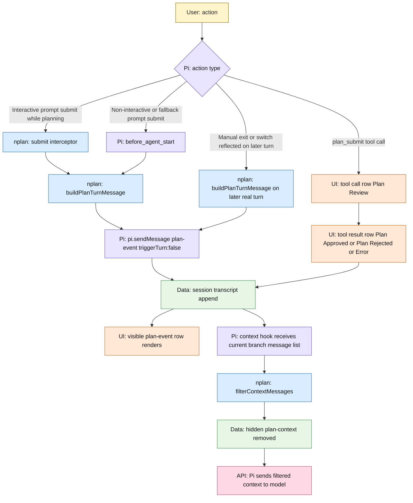
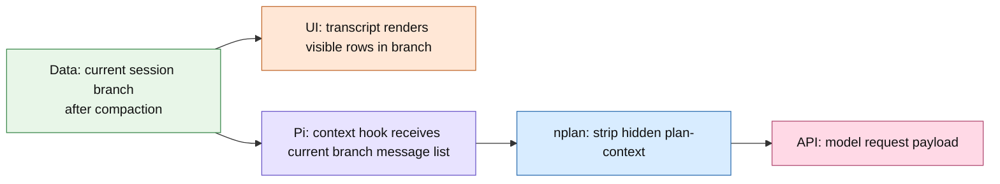
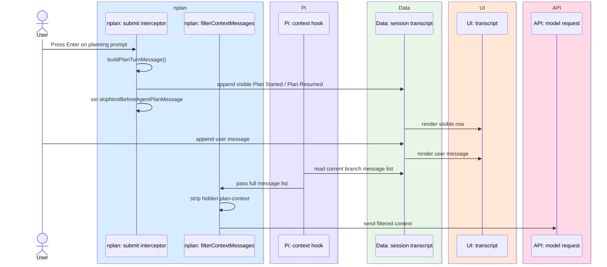
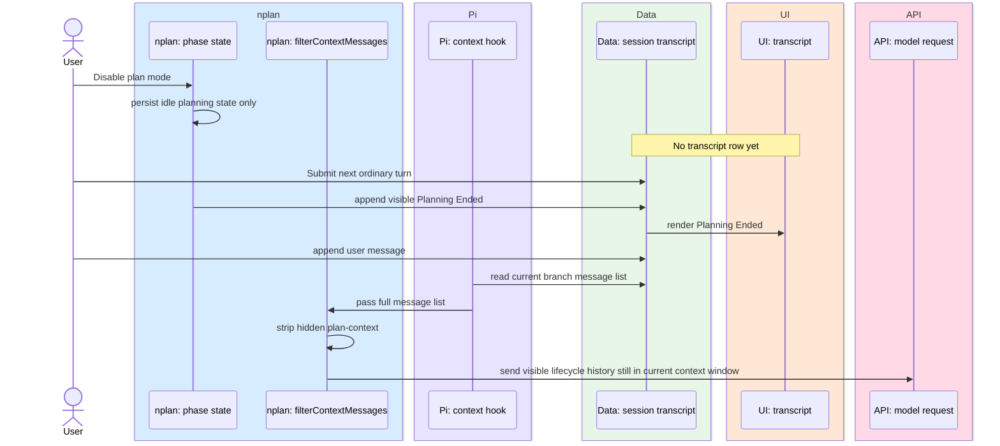
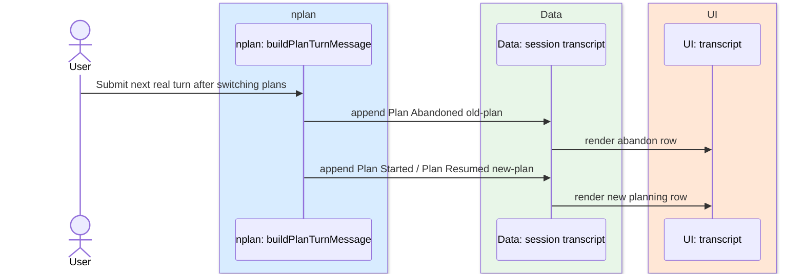
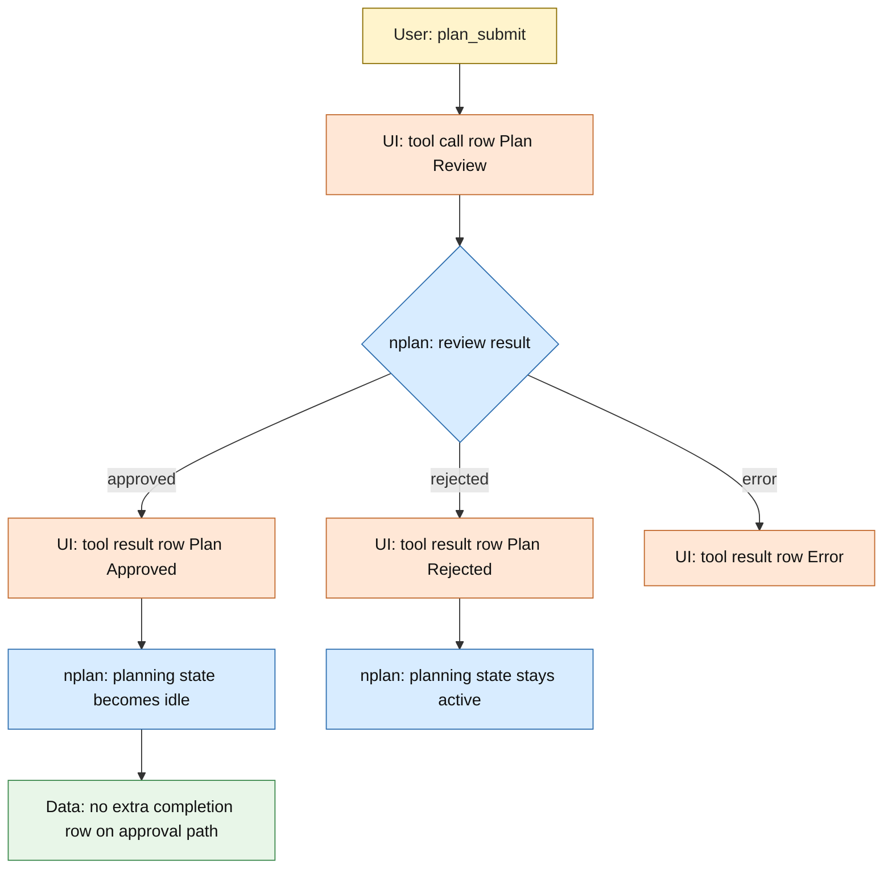

# nplan Planning Message Lifecycle

This document describes the current runtime architecture for planning messages.

`docs/prompts.md` is the required contract.
This file is the concrete pipeline map for how messages currently move through `nplan` and Pi.

## Overview

- Every planning lifecycle row is visible `plan-event` message.
- `nplan` does not use hidden `plan-context` injection path for planning prompt delivery.
- `filterContextMessages(...)` only strips hidden `plan-context` rows if they appear from older data or foreign input.
- `buildPlanTurnMessage(...)` decides which lifecycle row is still owed by comparing latest delivered `plan-event` state against latest persisted phase state.
- Plan switch can emit two rows on one turn: `Plan Abandoned <old>` first, then `Plan Started <new>` or `Plan Resumed <new>`.
- Full planning prompt body appears only on first `Plan Started` or `Plan Resumed` row in current compaction window.
- Current compaction window means latest `compaction` entry onward, resolved from `firstKeptEntryId`; if no compaction entry exists, whole current branch is one window.
- After compaction removes prompt-bearing row from model context window, next planning turn emits full prompt again.

## Diagram Legend

- `User`: human input
- `nplan`: extension-owned code in this repo
- `Pi`: Pi runtime hook or runtime-owned behavior
- `Data`: persisted session or transcript state
- `UI`: visible transcript or visible TUI surface
- `API`: model-facing request payload or model API boundary

## Runtime Map

## Pipeline Layers

## Interactive Planning Turn

Interactive Enter submit has its own fast path.
`registerSubmitInterceptor(...)` emits owed `plan-event` row before user message is appended, then sets `skipNextBeforeAgentPlanMessage` so `before_agent_start` path does not emit same row again.

## Manual Exit And Later Ordinary Turn

## Plan Switch On Next Turn

If attached plan changes between delivered state and persisted state, same turn can owe more than one row.
`buildPlanTurnMessage(...)` sends earlier owed rows immediately with `triggerTurn: false`, then returns final row for normal turn pipeline.

## Compaction Window Rule

`nplan-turn-messages.ts` scans current branch for latest `compaction` entry.
If found, prompt-resend check only looks at entries from `firstKeptEntryId` onward.

- If current window already contains visible `Plan Started` or `Plan Resumed` row with non-empty body, later planning rows in same window omit planning prompt body.
- If current window does not contain such row, next `Plan Started` or `Plan Resumed` row includes full planning prompt body.
- `Planning Ended` and `Plan Abandoned` rows never carry full planning prompt.

## Review Flow

## What The User Sees vs What The Agent Gets

| Layer | Data source | Current behavior |
|---|---|---|
| UI transcript | current session branch | shows visible `plan-event` rows and tool rows still present after compaction |
| Agent context | `context` hook output after `filterContextMessages(...)` | gets same visible `plan-event` rows still in current branch, plus normal tool/message history |

## Consequence

If current branch visibly contains `Plan Started ...` and later `Planning Ended ...`, UI and agent context both see both rows.

Full planning prompt itself still appears only once per compaction window, because later `Plan Started ...` or `Plan Resumed ...` rows omit prompt body until compaction resets allowance.

## Important Files

- `nplan-submit-interceptor.ts`: pre-submit `plan-event` emission for interactive Enter submits and fallback dedupe via `skipNextBeforeAgentPlanMessage`
- `nplan-turn-messages.ts`: computes owed lifecycle rows and prompt resend rule per compaction window
- `nplan-events.ts`: creates and renders visible `plan-event` transcript rows
- `nplan.ts`: wires `before_agent_start`, `context`, `plan_submit`, and phase transitions
- `nplan-context.ts`: strips hidden `plan-context` rows before Pi sends context to the model
