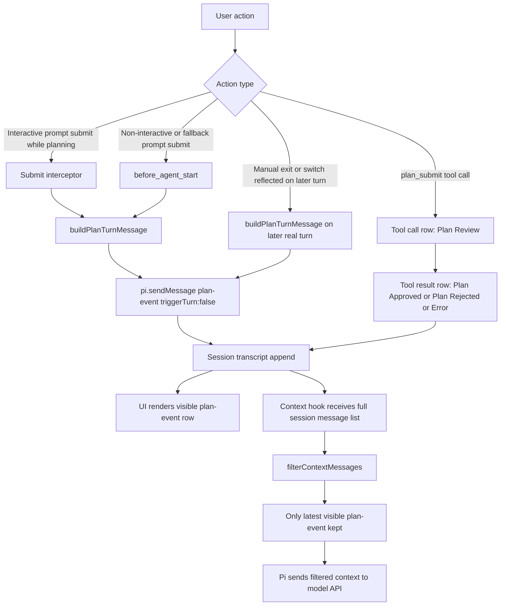
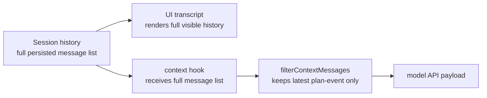
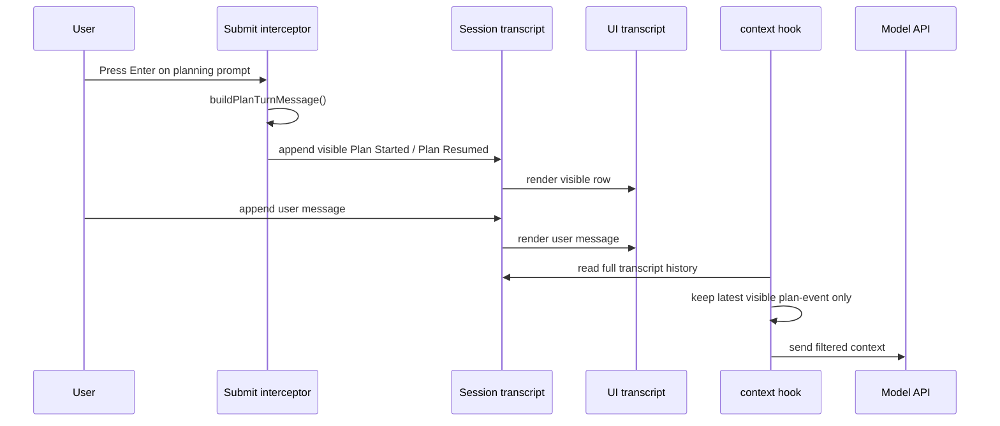
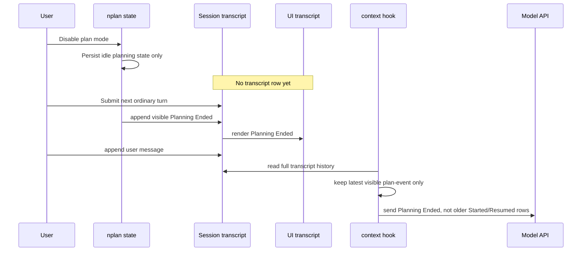
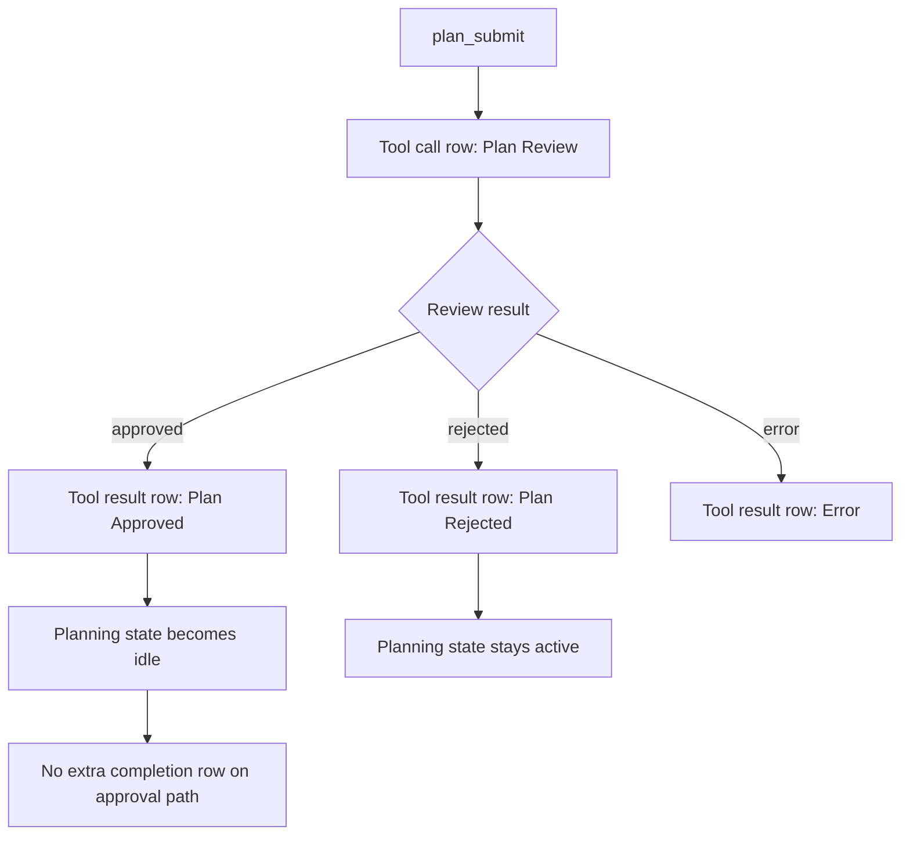

# nplan Planning Message Lifecycle

This document describes the current runtime architecture for planning messages.

`docs/prompts.md` is the required contract.
This file is the concrete pipeline map for how messages currently move through `nplan` and Pi.

## Overview

- `plan-event` messages are real persisted transcript entries.
- The UI renders the full persisted transcript history.
- The agent does not automatically receive the full visible transcript.
- The `context` hook filters transcript history before Pi sends it to the model.
- `nplan` currently keeps only the latest visible `plan-event` in agent context.

## Runtime Map

## Pipeline Layers

## Interactive Planning Turn

## Manual Exit And Later Ordinary Turn

## Review Flow

## What The User Sees vs What The Agent Gets

| Layer | Data source | Current behavior |
|---|---|---|
| UI transcript | full persisted session history | shows all visible `plan-event` rows and all tool rows |
| Agent context | `context` hook output after `filterContextMessages(...)` | gets only the latest visible `plan-event`, plus normal tool/message history |

## Consequence

If the transcript visibly contains both `Plan Started ...` and later `Planning Ended ...`, the UI shows both because both are persisted history entries.

The agent only gets `Planning Ended ...` on later turns because `filterContextMessages(...)` drops older `plan-event` rows and keeps only the latest one.

## Important Files

- `nplan-submit-interceptor.ts`: pre-submit `plan-event` emission for interactive Enter submits
- `nplan-turn-messages.ts`: computes which lifecycle row is owed on the current turn
- `nplan-events.ts`: creates and renders visible `plan-event` transcript rows
- `nplan.ts`: wires `before_agent_start`, `context`, `plan_submit`, and phase transitions
- `nplan-context.ts`: filters persisted transcript history before Pi sends context to the model
